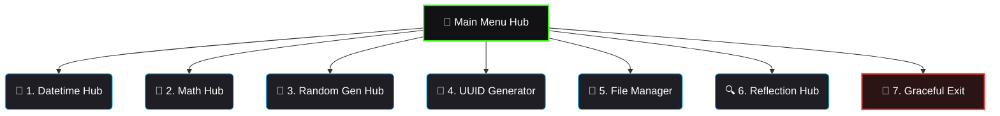

# Moduler-Packager
# 🛠️ Multi-Utility Toolkit

<div align="center">
  <div class="typing-container">
    <span class="typing-text">6-in-1 Terminal Powerhouse | Built with Pure Python</span>
  </div>
</div>

<style>
  .typing-container {
    display: inline-block;
    font-family: 'Fira Code', monospace;
    font-weight: 600;
    font-size: 24px;
    color: #39FF14;
    border-right: 3px solid #39FF14;
    white-space: nowrap;
    overflow: hidden;
    width: 0;
    animation: typing 3.5s steps(40, end) infinite alternate;
    margin: 20px 0;
  }

  @keyframes typing {
    0% { width: 0; }
    70% { width: 100%; }
    100% { width: 100%; }
  }
</style>


---

## ⚡ Quick Features Look

Hover over or expand the sections below to see what this toolkit can handle right from your terminal.

<details open>
<summary><b>📅 1. Datetime & Time Operations</b></summary>
<br>

* ⌚ **Live Clock:** Grabs the current system date and time instantly.
* ⏳ **Date Calculator:** Tells you the exact number of days between two dates.
* 🎨 **Custom Formatter:** Formats dates easily (e.g., changes `2026-09-11` into `Friday, September 11`).
* ⏱️ **Stopwatch:** Tracks real-time elapsed intervals with pinpoint accuracy.
* 🚨 **Countdown:** A simple visual live timer right inside your console.
</details>

<details>
<summary><b>🧮 2. Mathematical Engine</b></summary>
<br>

* ❗ **Factorial Solver:** Fast evaluation of big integers.
* 💰 **Compound Interest:** Simulates investment growth and breakdowns.
* 📐 **Trigonometry:** Calculates Sine, Cosine, and Tangent angles in a flash.
* 📐 **Area Solver:** Instantly finds the area of Circles, Rectangles, and Triangles.
</details>

<details>
<summary><b>🎲 3. Random Data Generator</b></summary>
<br>

* 🔢 **Random Ints:** Generates numbers between your custom min/max bounds.
* 📊 **Random Lists:** Creates custom-sized arrays filled with random numbers.
* 🔐 **Password Creator:** Spits out highly secure alphanumeric + symbol passwords.
* 📱 **OTP Spitter:** Generates numeric 4 or 6-digit one-time passcodes.
</details>

<details>
<summary><b>🔑 4. UUID Subsystem</b></summary>
<br>

* 🆔 **UUIDv4 Standard:** Generates unique 128-bit identifier strings instantly.
</details>

<details>
<summary><b>📂 5. File Operations Hub</b></summary>
<br>

* 📝 **File Control:** Safe creation, writing, reading, and appending for standard `.txt` files.
</details>

<details>
<summary><b>🔍 6. Namespace Inspector (`dir()`)</b></summary>
<br>

* 🔬 **Python Reflection:** Digs into core module architectures (`math`, `os`, `datetime`) to see available functions.
</details>

---

## 🗺️ Live Application Flow



---

## 🚀 Getting Started

### Requirements
* **Python 3.x** installed.
* **Zero Dependencies:** Uses only native built-in modules (`math`, `random`, `uuid`, `os`, `time`, `string`, `datetime`). No `pip install` required!

### Run the App
```bash
python toolkit.py
```

---

## 💻 Sample Terminal Output

```text
=======================================
Welcome to Multi-Utility Toolkit
=======================================
Choose an option:
1. Datetime and Time Operations
...
================================
Current Date and Time: 2026-09-11 12:51:44
Difference: 127 days
Factorial: 3628800
Generated Password: TY2QsTi1B1py
Generated UUID: f2ec8b38-a585-47a5-a552-47139109e8c4
============================
Thank you for using the Multi-Utility Toolkit!
============================
```

---

<!-- GitHub Card Animations CSS Layout Component -->
<style>
  summary {
    font-size: 1.15rem;
    padding: 12px;
    background: #18181b;
    border-radius: 8px;
    margin-bottom: 8px;
    cursor: pointer;
    border-left: 5px solid #39FF14;
    transition: all 0.3s ease-in-out;
    list-style: none;
    display: flex;
    align-items: center;
  }
  summary:hover {
    filter: brightness(1.2);
    transform: translateX(6px);
    background: #27272a;
  }
  summary::-webkit-details-marker {
    display: none;
  }
</style>
